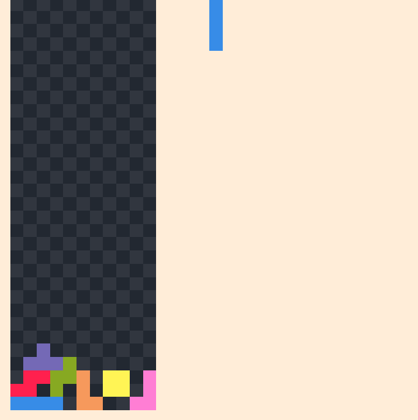
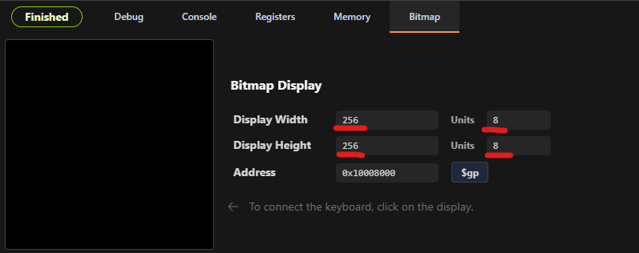

# MIPS Assembly Tetris  
This project is an implementation of the popular strategy game Tetris, made using MIPS Assembly Language.

## How to Play
- Use the A, S, D keys to move around.
- Use W to rotate the piece.
- Use P to Pause the Game.
- Graphical interface showcasing the battle progress.
- Background music and sound effects for an immersive experience. 


## Installation

To set up and run this Java project on your local machine, follow these steps:

1. **Clone the Repository**
    ```sh
    git clone https://github.com/tyseer2335/Tetris-MIPS-.git
    ```

2. **Install Saturn IDE**
    Install the proper version of Saturn IDE from [here](https://github.com/1whatleytay/saturn/releases/tag/app-v0.1.8).

3. **Set the Correct Bitmap Display**
 In Saturn, click the Run button on the top right, then set the Display Width and height to 258, and the Units to 8. 


6. **Drag and Drop**
    Drag the Tetris.asm file from the Repo into Saturn, then click run to play the game.
